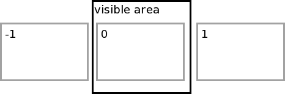
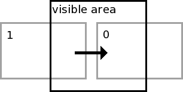
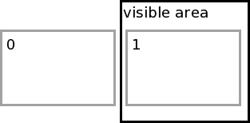

# Slideshow.js 1.5.2

Slideshow.js is a javascript slideshow, with touch/swipe support. [Demo here](https://olmokramer.github.io/slideshow.js)

# Usage

Create some slides in a container:

```html
<div class="slides-container">
  <div class="slide"></div>
  <div class="slide"></div>
  <div class="slide"></div>
  <div class="slide"></div>
</div>
```

Then create a new slideshow from the container element:

```js
var container = document.querySelector('.slides-container')
var slideshow = new Slideshow(container, options);
```

Support for touch events will be automatically detected, but it can be explicitly disabled.

## Options

| option | required | type | default | description |
|---|---|---|---|---|
| touchEnabled | no | boolean | true | Enable or disable touch events on the slideshow. |
| preventDefaultEvents | no | boolean | true | Prevent default events on the slideshow element. |
| animationDuration | no | number | 400 | The duration of the animation. |
| onWillChange | no | function | Fired when the animation is about to start, in the case of a touch event, this fires right after the `touchEnd` event. `this` refers to the slideshow instance. |
| onDidChange | no | function | Fired when the animation is finished. `this` refers to the slideshow instance. |
| effect | no | object | ... | Object that defines the animation of the slides. See [Effect](#effect). |
| conditions | no | array | ... | Conditions to determine if a slide should occur after a touch event. See [Conditions](#conditions) |

## <a name="conditions"></a>Conditions

The conditions array is used to determine if after a touch event, it should slide to the next image, or slide the current image back. The array should consist of objects, each of which can have up to three keys:

| key | required | type | default | description |
|---|---|---|---|---|
| progress | yes | float | no default value | The minimum percentage of the slideshow element's width (height will also be supported) that the user must have touched the slideshow. Between 0 and 1. |
| time | no | int | Infinity | The maximum duration of the touch event. |
| durationModifier | no | float | 1 | Modifier for the animation duration, if this condition passes. |

When a touch event ends, the total distance and duration of the touch event will be measured. The distance is divided by the width of the slides' parent, to get the `progress`.

Each condition in the array is compared to the touch event according to `touchEventProgress > condition.progress && touchEventDuration < condition.time`. When this evaluates to true, the slideshow will proceed to animate to the next slide, when false the slideshow will return to the current slide.

#### Example

This is de default conditions array.

```js
conditions: [{
  progress: .1,
  time: 250,
  durationModifier: .5
}, {
  progress: .3,
  time: 500
}, {
  progress: .5
}]
```

Let's say the user swiped the slideshow over 40% of its width, so `progress = 0.4`, in `duration = 300ms`.

While `progress` (`= .4`) is greater than `condition.distance` (`= .1`), `duration` (`= 300`) isn't less than `condition.time` (`= 250`), so the first condition fails. In the second condition, both pass and the slideshow goes to the next slide.

## <a name="effect"></a>Effect

The effect option is an object with three functions:

| name | description |
|---|---|
| before | Executed right before the animation starts.|
| progress | The actual animation function. |
| after | Executed right after the animation finishes. |

#### effect.before(slideState, slideElement)

Executed right before the animation starts. You can put the slide elements that are going to be animated in the right place with this function.

| param | type | description |
|---|---|---|
| slideState | int | `-1`, `0` or `1`, where `-1` means `slideElement` is the previous slide, `0` means `slideElement` is the current slide and `1` means `slideElement` is the next slide. |
| slideElement | HTMLElement | The slide's DOM element. |

The values of slideState and their corresponding slides in the before function:



#### effect.progress(slideState, progress, slideElement)

The actual animation function. This function is called in a `requestAnimationFrame` loop. The plugin provides it's own fallback for `requestAnimationFrame`.

| param | type | description |
|---|---|---|
| slideState | int | `0` or `1`, where 0 means `slideElement` is the slide that is going away and 1 means `slideElement` is the slide that is coming into view. |
| progress | number | The progress of the animation, anywhere between `-1` and `1`. `0` means nothing has happened yet and both `-1` and `1` mean that the animation has finished. A negative number indicates going to the previous slide, a positive number indicates going to the next slide. |
| slideElement | HTMLElement | The slide's DOM element. |

Arguments:

The values of slideState and their corresponding slides in the progress function (the slides are moving to the right in this image):



The progress function is where the animating happens. Use it to modify properties of the `slideElement.style`, according to the progress. Lightweight progress functions increase animation performance.

#### effect.after(slideState, slideElement)

Executed right after the animation finishes. You can clean up here, for example hide the previous slide.

| param | type | description |
|---|---|---|
| slideState | int | `0` or `1`, where `0` means `slideElement` is the slide that moved away and `1` means `slideElement` is the slide that moved in. |
| slideElement | HTMLElement | The slide's DOM element. |

The values of slideState and their corresponding slides in the after function (a slide to the left has just occurred in this image):



#### Example

Instead of a slide left to right, we want a fade. You can check this out in the demo (the second gallery). It could be accomplished like this:

```js
effect: {
  before: function(slideState, slideElement) {
    if (slideState === 0) {
      // this is the currently visible slide. we want it to
      // be totally opaque before animating it to totally transparent.
      slideElement.style.opacity = 1;
    } else {
      // this is the slide that will become opaque, but first
      // it should be transparent.
      slideElement.style.opacity = 0;
    }
  },
  progress: function(slideState, progress, slideElement) {
    // get the absolute value of the property, because we are
    // not interested in left/right
    progress = Math.abs(progress);
    // the slide that was visible at first should become
    // more and more transparent as we progress further.
    // the other element should get more opaque.
    if (slideState === 0) {
      slideElement.style.opacity = 1 - progress;
    } else {
      slideElement.style.opacity = progress;
    }
  },
  after: function(slideState, slideElement) {
    // the new slide should be on top for save image (etc.) to work
    if (slideState === 0) {
      // this is the previous slide, so send down
      slideElement.style.zIndex = 0
    } else {
      // this is the next slide so send to top
      slideElement.style.zIndex = 1
    }
  }
}
```

## Methods

Instances of `Slideshow` have the following methods.

#### getSlide(index)

Gets the element of the slide at given index. Applies modulo to the index.

| param | description |
|---|---|
| index | The index of the slide to return. Starts at 0 |

#### getCurrentSlide()

Gets the element of the currently visible slide

#### getNextSlide()

Gets the slide after the currently visible one

#### getPrevSlide()

Gets the slide before the currently visible one

#### getFirstSlide()

Gets the first slide. Equivalent to `getSlide(0)`

#### getLastSlide()

Gets the last slide. Equivalent to `getSlide(slides.length - 1)`

#### goTo(index, callback)

Go to the slide at given index. Calls callback when the animation is finished.

| param | description |
|---|---|
| index | index of the target slide |
| callback | callback function, called when the animation is finished |

#### goToNext(callback)

Go to the next slide. Continues with first slide if currently on last slide.

| param | description |
|---|---|
| callback | callback function, called when the animation is finished |

#### goToPrev(callback)

Go to the previous slide. Continues with last slide if currently on first slide.

| param | description |
|---|---|
| callback | callback function, called when the animation is finished |

#### goToFirst

Go to the first slide.

| param | description |
|---|---|
| callback | callback function, called when the animation is finished |

#### goToLast

Go to the last slide.

| param | description |
|---|---|
| callback | callback function, called when the animation is finished |

## Class methods

The `Slideshow` class itself has the following methods.

#### Slideshow.registerAsJQueryPlugin(jQuery, methodName)

Registers slideshow.js as a jQuery plugin, to be called with `jQuery[methodName](options)`

| param | description |
|---|---|
| jQuery | The jQuery object to extend. |
| methodName | The name of the plugin method. The method returns an array of `Slideshow` instances. |

#### Example

```js
Slideshow.registerAsJQueryPlugin(window.jQuery, 'Slideshow');

$('.slideshow-container').Slideshow(slideshowOptions);
```

## Acknowledgement

A lot of credit goes to [slides.js](http://slidesjs.com/), which has been a huge inspiration for this project. I thought it wasn't customisable enough and I wanted to get rid of the jQuery requirement, so I created slideshow.js.

## License

This project is licensed under the [MIT license](LICENSE).<br>
&copy; 2015, Olmo Kramer
